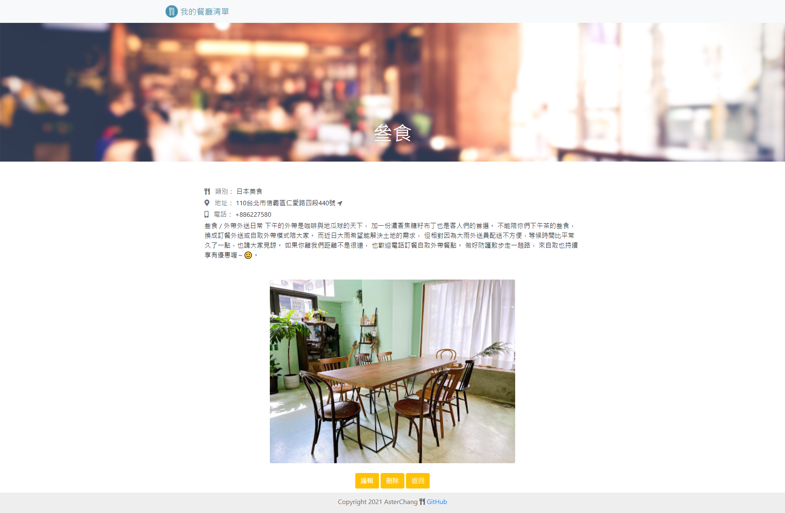

# 我的餐廳清單

這是一個 Node.js + Express 打造的搜尋餐廳清單

## 產品功能

- 首頁可以看到所有餐廳與它們的簡單資料
- 輸入 "餐廳名稱" 及 "餐廳類別" 進行搜尋
- 點選 "餐廳類別" 按鈕進行搜尋
- 可以檢視餐廳詳細資訊，包含類別、地址、電話、描述、圖片
- 可以新增餐廳資訊
- 可以重新編輯餐廳資訊

## 環境建置與需求

- [Visual Studio Code for Win](https://code.visualstudio.com/)
- [Node.js](https://nodejs.org/en/)
- [Express](https://www.npmjs.com/package/express)
- [Express-Handlebars](https://www.npmjs.com/package/express-handlebars)
- [nodemon](https://www.npmjs.com/package/nodemon)
- [mongoose](https://www.npmjs.com/package/mongoose)
- [body-parser](https://www.npmjs.com/package/body-parser)

## 安裝流程

1. 打開你的終端機(terminal)，Clone 此專案至本機電腦

```
git clone https://github.com/asterchang96/restaurant_list.git
```

2. 進入至專案資料夾

```
cd restaurant_list
```

3. 安裝 npm 相關套件

```
npm install
```

4. 載入預設資料

```
node models/seeds/restaurantSeeder.js
```

6. 啟動專案

```
npm run dev
```

5. 當 終端機(terminal) 出現以下字樣，代表執行成功

```
Express is listening on localhost: 3000.
```

請至 [http://localhost:3000](http://localhost:3000)

## 成果截圖





## 開發者

[AsterChang](https://github.com/asterchang96)
